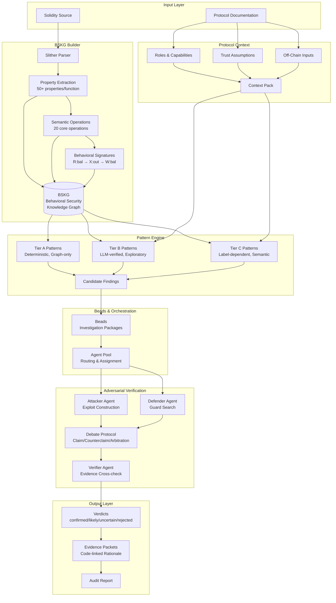
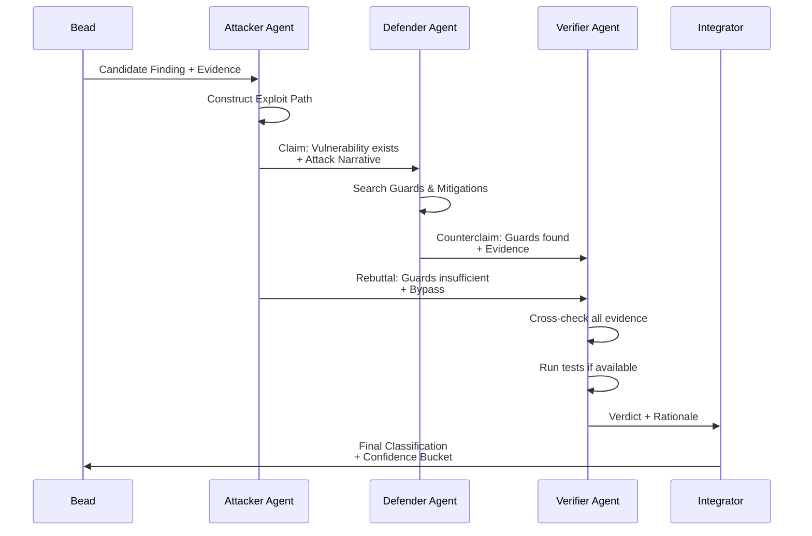

# AlphaSwarm.sol Architecture Diagram

## End-to-End System Flow



## Behavioral Signature Derivation

```mermaid
flowchart LR
    subgraph Source["Source Code"]
        FUNC["function withdraw(uint amt)"]
        CODE["require(balances[msg.sender] >= amt);<br/>(bool ok,) = msg.sender.call{value: amt}(\"\");<br/>balances[msg.sender] -= amt;"]
    end

    subgraph Analysis["Semantic Analysis"]
        OP1["READS_USER_BALANCE"]
        OP2["TRANSFERS_VALUE_OUT"]
        OP3["WRITES_USER_BALANCE"]
    end

    subgraph Signature["Behavioral Signature"]
        SIG["R:bal → X:out → W:bal"]
        PATTERN["Reentrancy Pattern Match"]
    end

    FUNC --> CODE
    CODE --> OP1
    CODE --> OP2
    CODE --> OP3
    OP1 --> SIG
    OP2 --> SIG
    OP3 --> SIG
    SIG --> PATTERN
```

## Three-Tier Pattern Hierarchy

```mermaid
flowchart TB
    subgraph TierA["Tier A: Deterministic"]
        A1[Graph Properties]
        A2[Semantic Operations]
        A3[Signature Ordering]
        A4[HIGH Confidence<br/>No LLM Required]
    end

    subgraph TierB["Tier B: Exploratory"]
        B1[Graph + Context Questions]
        B2[LLM Verification]
        B3[MEDIUM Confidence<br/>Targets Complex Logic]
    end

    subgraph TierC["Tier C: Label-Dependent"]
        C1[Semantic Labels from LLM Pass]
        C2[Label Presence/Absence Matching]
        C3[MEDIUM Confidence<br/>Policy & Invariant Violations]
    end

    A1 --> A2 --> A3 --> A4
    B1 --> B2 --> B3
    C1 --> C2 --> C3
```



## Adversarial Verification Protocol


