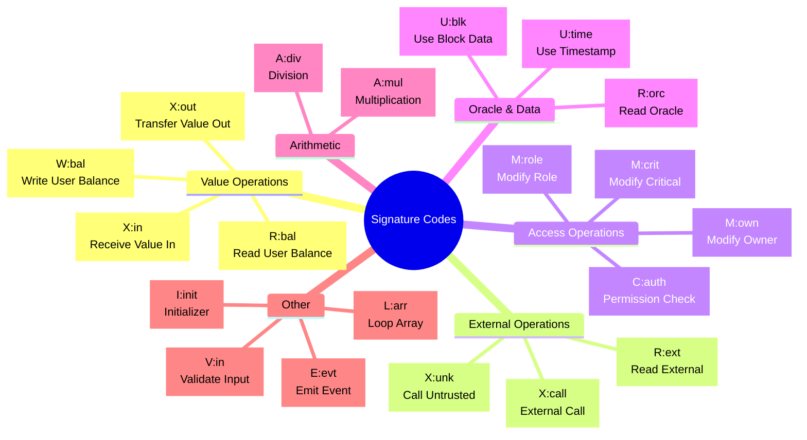
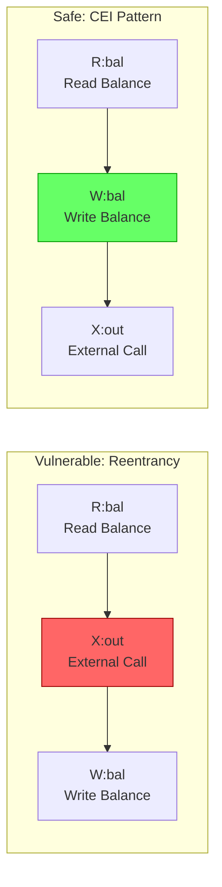
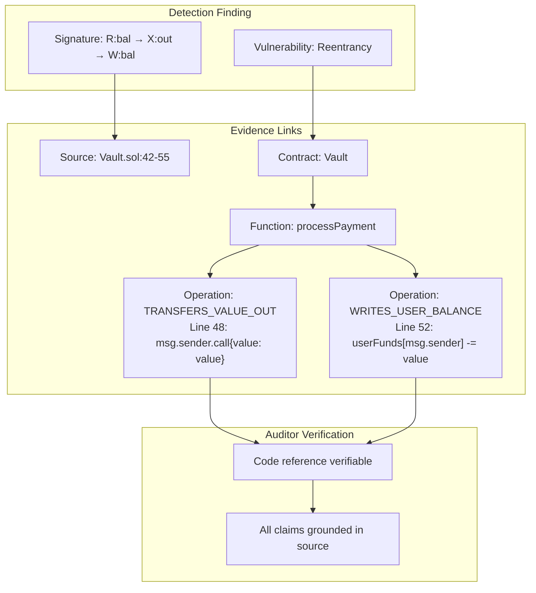

# BSKG Behavioral Signature Flow

## From Code to Signature

```mermaid
flowchart TB
    subgraph Source["Solidity Source"]
        CODE["function processPayment(uint value) external {<br/>    require(userFunds[msg.sender] >= value);<br/>    (bool success,) = msg.sender.call{value: value}(\"\");<br/>    userFunds[msg.sender] -= value;<br/>}"]
    end

    subgraph Slither["Slither Parsing"]
        AST[Abstract Syntax Tree]
        CFG[Control Flow Graph]
        IR[Slither IR]
    end

    subgraph Extraction["Property & Operation Extraction"]
        PROP1["visibility: external"]
        PROP2["sends_value: true"]
        PROP3["reads_balances: true"]
        PROP4["writes_balances: true"]
        PROP5["has_reentrancy_guard: false"]

        OP1["READS_USER_BALANCE<br/>userFunds[msg.sender]"]
        OP2["TRANSFERS_VALUE_OUT<br/>msg.sender.call{value: value}"]
        OP3["WRITES_USER_BALANCE<br/>userFunds[msg.sender] -= value"]
    end

    subgraph Ordering["Order Analysis"]
        SEQ["Execution Order:<br/>1. require (read)<br/>2. call (transfer)<br/>3. assignment (write)"]
    end

    subgraph Signature["Behavioral Signature"]
        SIG["R:bal → X:out → W:bal"]
        CODES["Signature Codes:<br/>R:bal = read user balance<br/>X:out = transfer value out<br/>W:bal = write user balance"]
    end

    subgraph Matching["Pattern Matching"]
        PATTERN["Pattern: reentrancy-classic<br/>Requires: X:out before W:bal<br/>Without: reentrancy_guard"]
        MATCH["MATCH: Vulnerable Pattern"]
    end

    CODE --> AST
    AST --> CFG
    CFG --> IR

    IR --> PROP1
    IR --> PROP2
    IR --> PROP3
    IR --> PROP4
    IR --> PROP5

    IR --> OP1
    IR --> OP2
    IR --> OP3

    OP1 --> SEQ
    OP2 --> SEQ
    OP3 --> SEQ

    SEQ --> SIG
    SIG --> CODES

    SIG --> PATTERN
    PROP5 --> PATTERN
    PATTERN --> MATCH
```

## Signature Code Reference



## Safe vs Vulnerable Signatures



## Evidence Linking


