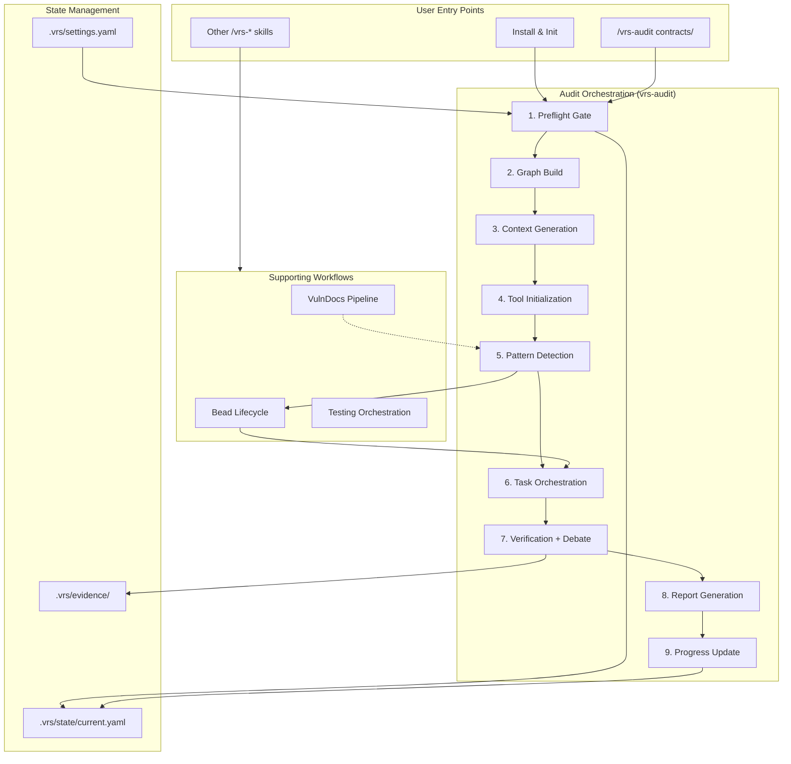
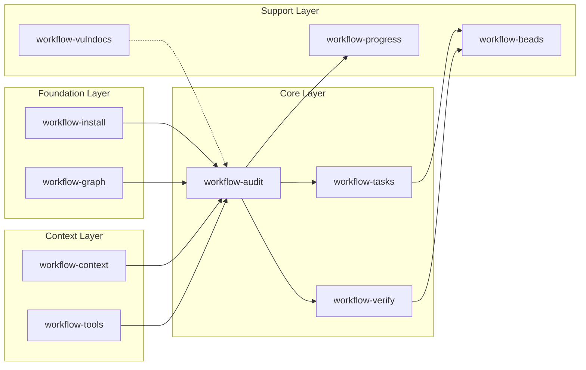
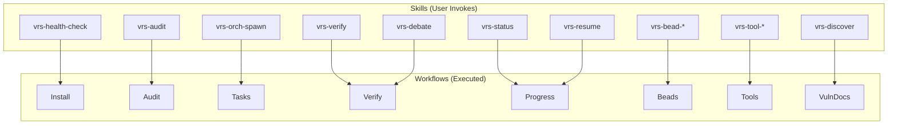
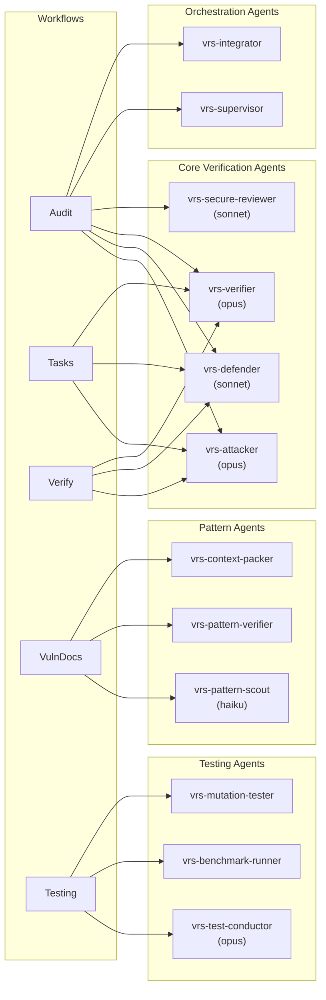
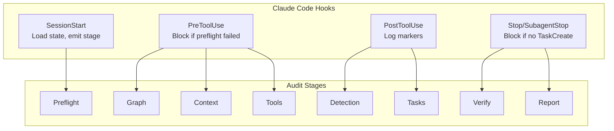
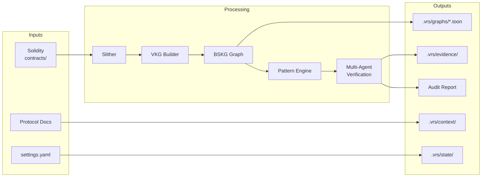

# Master Workflow Orchestration

**Purpose:** Show how all AlphaSwarm.sol workflows connect and interact.

## High-Level Flow

## Workflow Dependencies

## Skill-to-Workflow Mapping

## Agent Involvement by Workflow

## Hook Enforcement Points

## Data Flow

## Cross-References

| Workflow | Primary Doc | Skills | Agents |
|----------|-------------|--------|--------|
| Install | `workflow-install.md` | `vrs-health-check` | None |
| Graph | `workflow-graph.md` | `vrs-graph-contract-validate` | None |
| Context | `workflow-context.md` | `vrs-context-pack`, `vrs-economic-context` | `vrs-context-packer` |
| Tools | `workflow-tools.md` | `vrs-tool-slither`, `vrs-tool-aderyn` | None |
| Audit | `workflow-audit.md` | `vrs-audit` | All core agents |
| Tasks | `workflow-tasks.md` | `vrs-orch-spawn`, `vrs-orch-resume` | `attacker`, `defender`, `verifier` |
| Verify | `workflow-verify.md` | `vrs-verify`, `vrs-debate` | `attacker`, `defender`, `verifier` |
| Progress | `workflow-progress.md` | `vrs-status`, `vrs-resume` | None |
| Beads | `workflow-beads.md` | `vrs-bead-*` | Varies |
| VulnDocs | `workflow-vulndocs.md` | `vrs-discover`, `vrs-refine`, etc. | Pattern agents |
