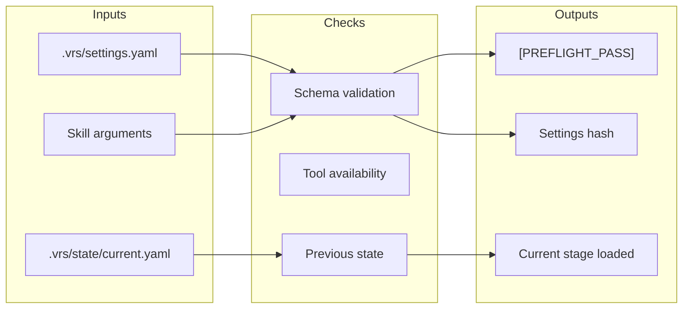
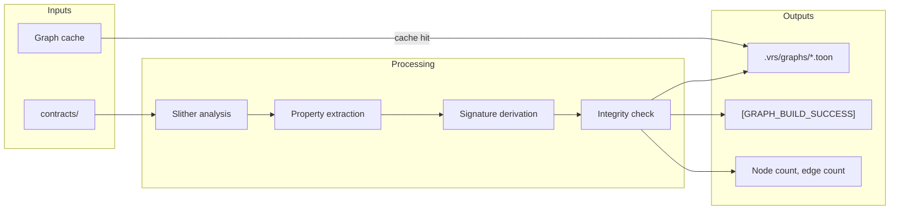
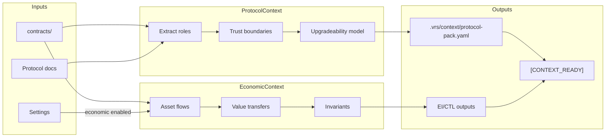
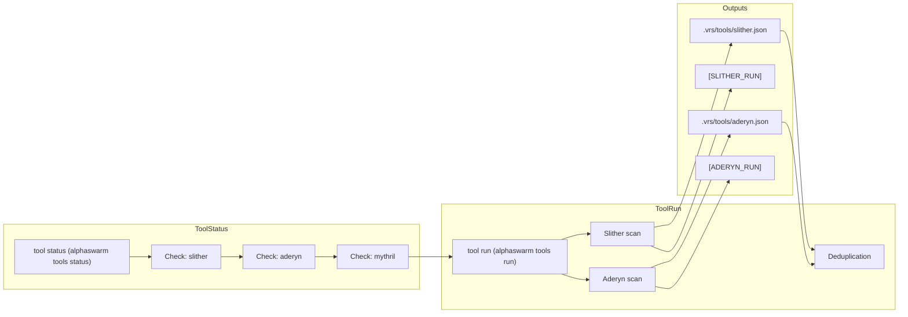
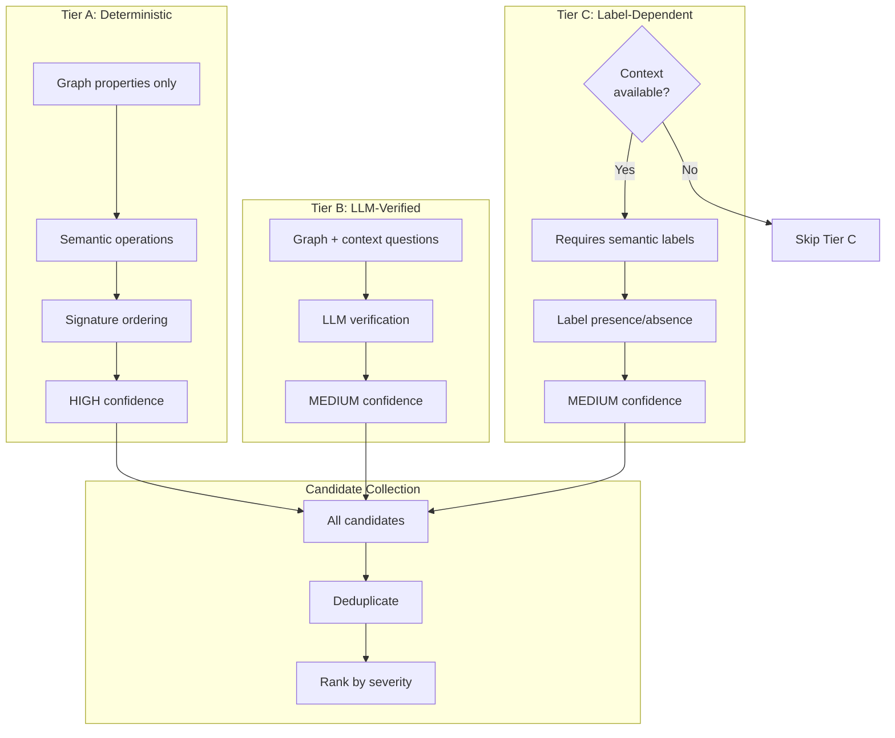
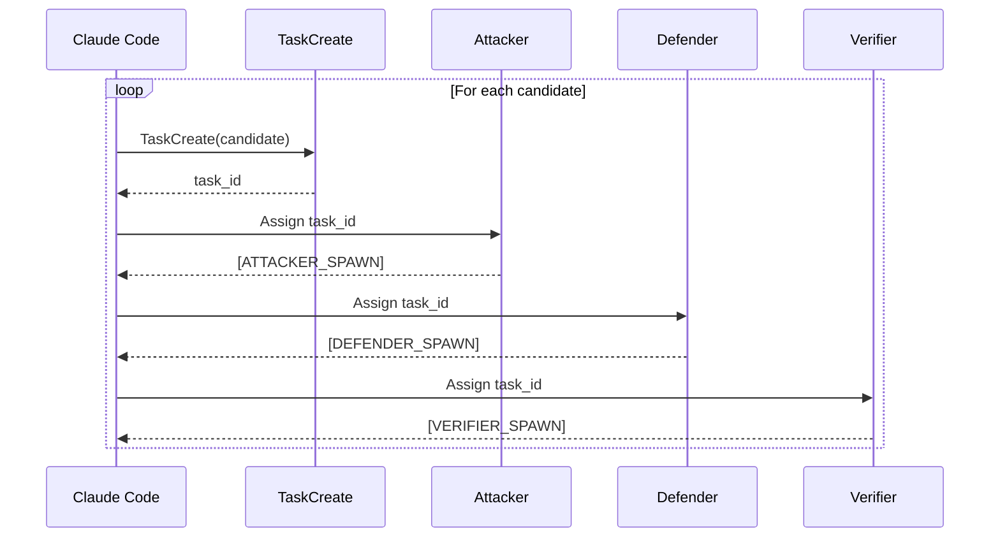
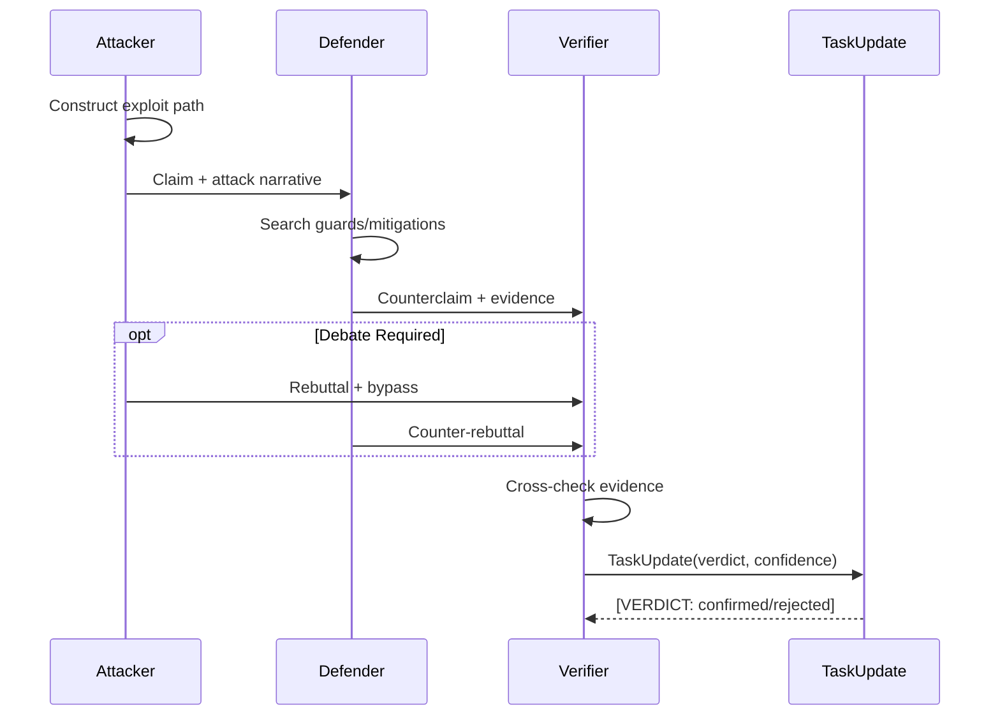
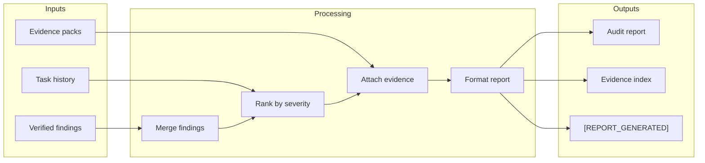
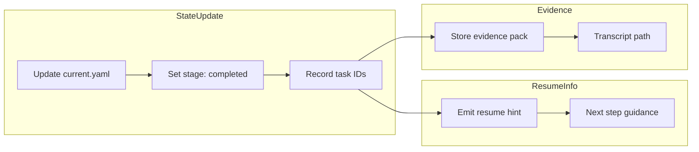

# Audit Entrypoint Stage Flow

**Purpose:** Detail the 9-stage audit pipeline with inputs, outputs, and decision points.

## Stage Overview

```mermaid
flowchart TB
    START((Start))

    subgraph Stage1["Stage 1: Preflight Gate"]
        P1["Validate .vrs/settings.yaml"]
        P2["Check tool availability"]
        P3["Load state from current.yaml"]
        P_FAIL{"Preflight<br/>passed?"}
    end

    subgraph Stage2["Stage 2: Graph Build"]
        G1["Check graph cache"]
        G2["Build via Slither"]
        G3["Serialize to .toon"]
        G_CHECK{"Graph<br/>valid?"}
    end

    subgraph Stage3["Stage 3: Context Generation"]
        C1["Generate protocol context"]
        C2["Generate economic context"]
        C3["Validate required fields"]
        C_CHECK{"Context<br/>complete?"}
    end

    subgraph Stage4["Stage 4: Tool Initialization"]
        T1["Tool status call (alphaswarm tools status)"]
        T2["Tool scan call (alphaswarm tools run)"]
        T3["Collect tool outputs"]
    end

    subgraph Stage5["Stage 5: Pattern Detection"]
        D1["Tier A: Deterministic"]
        D2["Tier B: LLM-verified"]
        D3["Tier C: Label-dependent"]
        D4["Collect candidates"]
    end

    subgraph Stage6["Stage 6: Task Orchestration"]
        O1["TaskCreate per candidate"]
        O2["Assign to agents"]
        O3["Track task IDs"]
    end

    subgraph Stage7["Stage 7: Verification + Debate"]
        V1["Attacker: exploit path"]
        V2["Defender: guards"]
        V3["Verifier: arbitrate"]
        V4["TaskUpdate with verdict"]
    end

    subgraph Stage8["Stage 8: Report Generation"]
        R1["Merge verified findings"]
        R2["Attach evidence"]
        R3["Generate report"]
    end

    subgraph Stage9["Stage 9: Progress Update"]
        S1["Update current.yaml"]
        S2["Emit resume hint"]
        S3["Store evidence pack"]
    end

    ABORT((Abort))
    DONE((Done))

    START --> P1
    P1 --> P2 --> P3 --> P_FAIL
    P_FAIL -->|No| ABORT
    P_FAIL -->|Yes| G1

    G1 --> G2 --> G3 --> G_CHECK
    G_CHECK -->|No| ABORT
    G_CHECK -->|Yes| C1

    C1 --> C2 --> C3 --> C_CHECK
    C_CHECK -->|No, Tier C disabled| T1
    C_CHECK -->|Yes| T1

    T1 --> T2 --> T3 --> D1

    D1 --> D2 --> D3 --> D4 --> O1

    O1 --> O2 --> O3 --> V1

    V1 --> V2 --> V3 --> V4 --> R1

    R1 --> R2 --> R3 --> S1

    S1 --> S2 --> S3 --> DONE
```



## Stage Details

### Stage 1: Preflight Gate



**Required Markers:**
- `[PREFLIGHT_PASS]` or `[PREFLIGHT_FAIL: reason]`
- Settings hash in evidence

**Failure Behavior:**
- Emit guidance: what failed, why, next action
- Halt with non-zero exit

### Stage 2: Graph Build



**Required Markers:**
- `[GRAPH_BUILD_SUCCESS]` or `[GRAPH_BUILD_FAIL]`
- Node count for integrity check

**Underlying Tool Call (typically orchestrated by Claude Code):**
```bash
uv run alphaswarm build-kg contracts/ --with-labels
```

### Stage 3: Context Generation



**Required Fields for Tier C:**
- Roles (admin, user, operator, etc.)
- Upgradeability model
- Asset flows
- Trust boundaries

**Tier C Gating:**
```
IF context.fields.missing > 0 AND tier_c.enabled:
    WARN "Tier C gating: missing fields"
    SKIP Tier C patterns
```

### Stage 4: Tool Initialization



**Required Markers:**
- `[TOOL_STATUS]`
- `[SLITHER_RUN]`, `[ADERYN_RUN]`, etc.
- Tool output paths in evidence

### Stage 5: Pattern Detection



**Pattern Flow per Tier:**
| Tier | Input | Process | Output |
|------|-------|---------|--------|
| A | BSKG graph | Property + signature match | HIGH confidence candidates |
| B | BSKG + context | LLM verification questions | MEDIUM confidence candidates |
| C | BSKG + labels | Label match with thresholds | MEDIUM confidence candidates |

### Stage 6: Task Orchestration



**Required Markers:**
- `TaskCreate` with task ID
- `[ATTACKER_SPAWN]`, `[DEFENDER_SPAWN]`, `[VERIFIER_SPAWN]`
- Task ID tracking

### Stage 7: Verification + Debate



**Verdict Types:**
| Verdict | Meaning | Confidence |
|---------|---------|------------|
| `confirmed` | Verified by test or consensus | HIGH |
| `likely` | Strong evidence, no proof | >= 0.75 |
| `uncertain` | Weak or conflicting | 0.40-0.75 |
| `rejected` | Disproven or benign | - |

### Stage 8: Report Generation



### Stage 9: Progress Update



**State Schema (current.yaml):**
**Note:** State management functionality is planned for future implementation.

```yaml
run_id: "audit-2026-02-03-001"
stage: "completed"
completed_stages: [preflight, graph, context, tools, detection, tasks, verify, report, progress]
tasks:
  - id: task-001
    verdict: confirmed
  - id: task-002
    verdict: rejected
resume_hint: "/vrs-orch-resume <pool-id>"
evidence_path: ".vrs/evidence/audit-2026-02-03-001/"
```

## Marker Summary

| Stage | Required Markers |
|-------|------------------|
| Preflight | `[PREFLIGHT_PASS/FAIL]`, settings hash |
| Graph | `[GRAPH_BUILD_SUCCESS/FAIL]`, node count |
| Context | `[CONTEXT_READY]`, context fields |
| Tools | `[TOOL_STATUS]`, `[SLITHER_RUN]`, `[ADERYN_RUN]` |
| Detection | `[DETECTION_COMPLETE]`, candidate count |
| Tasks | `TaskCreate`, `[*_SPAWN]` markers |
| Verify | `TaskUpdate`, `[VERDICT: *]` |
| Report | `[REPORT_GENERATED]` |
| Progress | `[STATE_UPDATED]`, resume hint |
