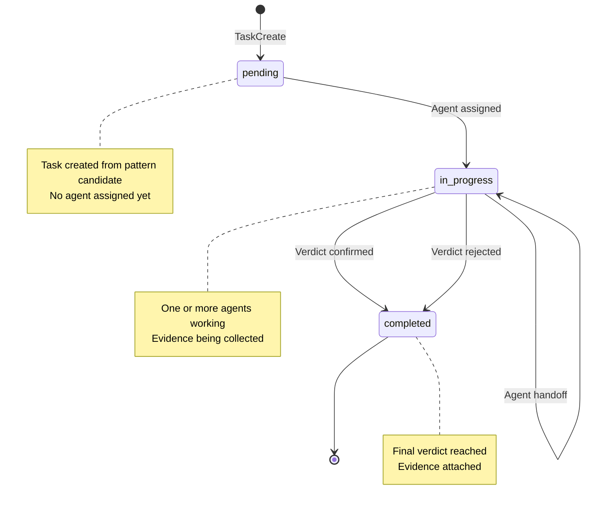
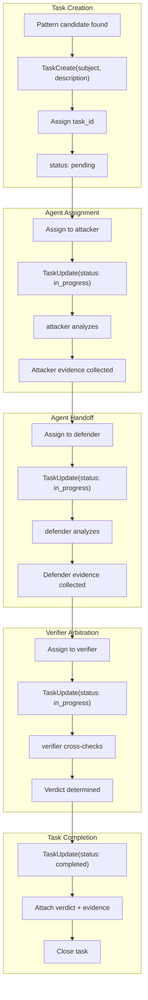
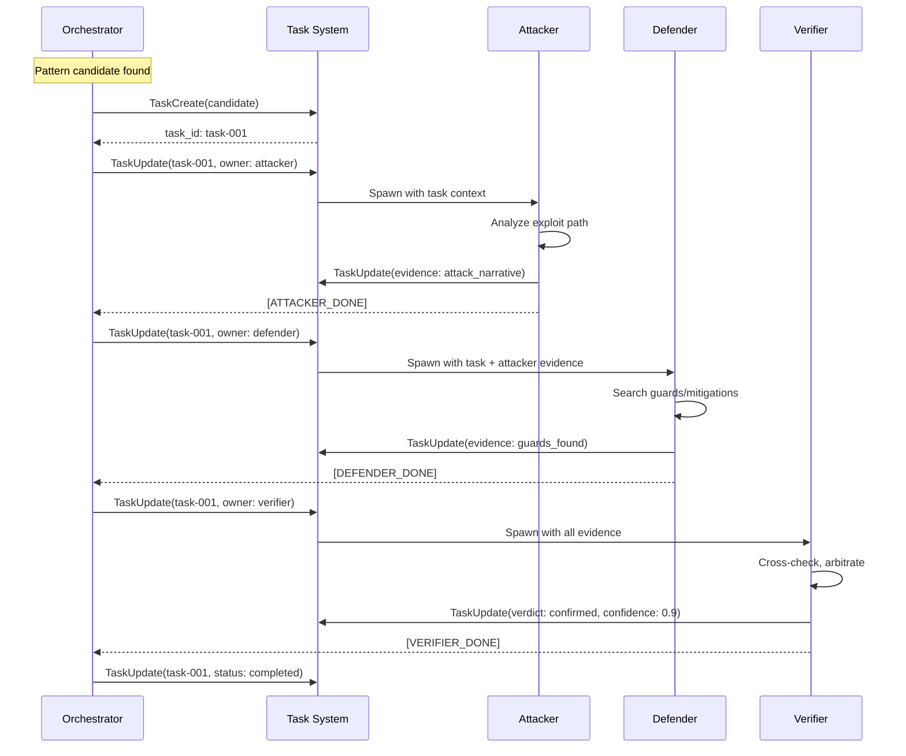
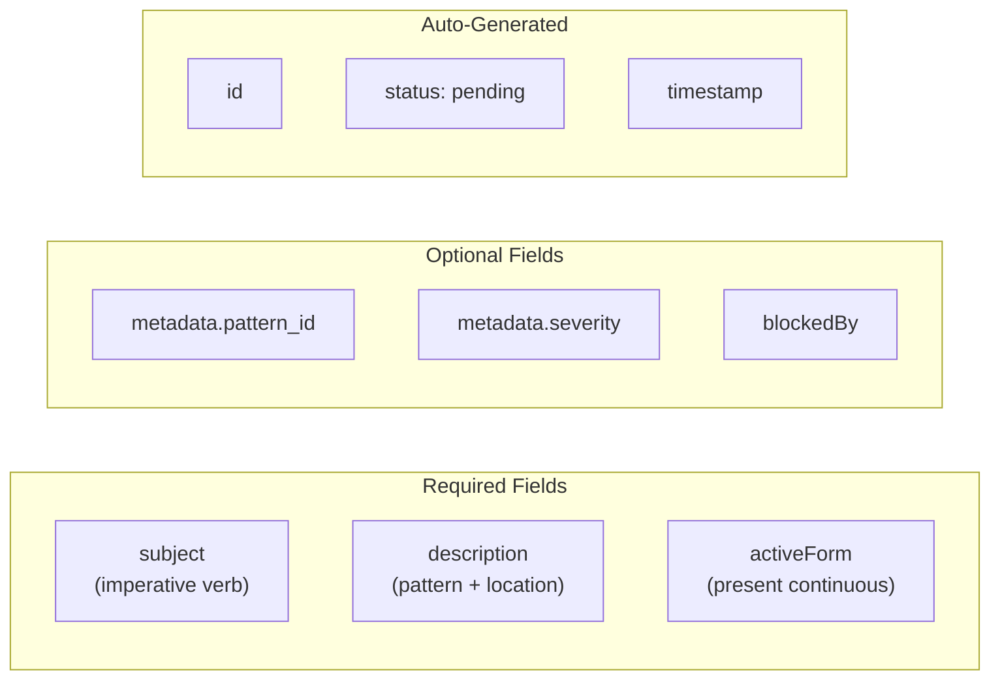
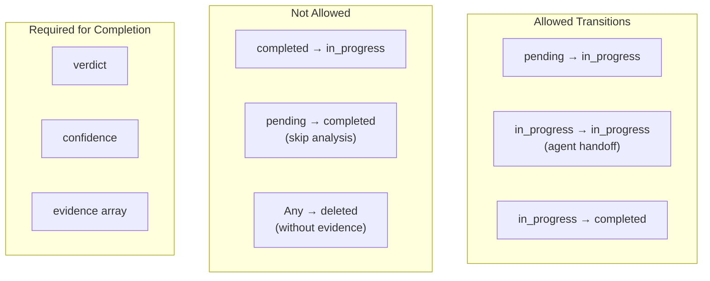
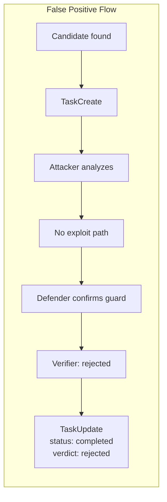
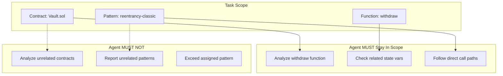
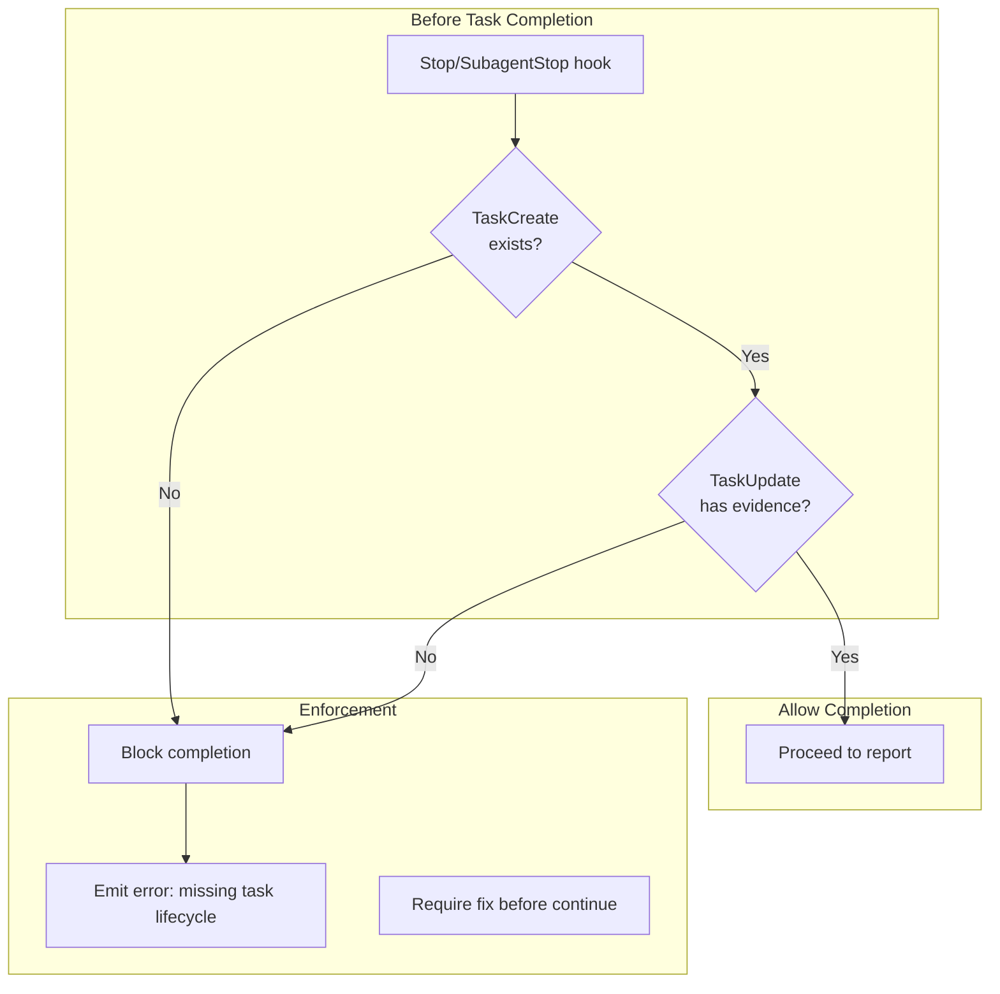

# Task Lifecycle State Machine

**Purpose:** Define TaskCreate/TaskUpdate state transitions and agent assignments.

## Task States



## Detailed Task Flow



## Task Schema

```yaml
task:
  id: "task-001"                    # Unique identifier
  subject: "Reentrancy in withdraw" # Brief title (imperative)
  description: |                    # Detailed description
    Pattern: reentrancy-classic
    Location: Vault.sol:42-55
    Signature: R:bal -> X:out -> W:bal
  activeForm: "Investigating reentrancy"  # Present continuous form
  status: "in_progress"             # pending | in_progress | completed
  owner: "vrs-attacker"             # Current agent
  metadata:
    pattern_id: "reentrancy-classic"
    severity: "high"
    confidence: 0.85
  evidence:
    - type: "graph_node"
      id: "func_vault_withdraw_123"
    - type: "code_location"
      file: "Vault.sol"
      lines: [42, 55]
  blocks: []                        # Task IDs this blocks
  blockedBy: []                     # Task IDs blocking this
```

## Agent Assignment Sequence



## TaskCreate Requirements



**Subject Naming:**
| Good | Bad |
|------|-----|
| "Investigate reentrancy in withdraw" | "reentrancy-001" |
| "Verify access control on setOwner" | "task" |
| "Check oracle manipulation risk" | "finding #3" |

## TaskUpdate Rules



**TaskUpdate Evidence Requirements:**
| Verdict | Min Evidence Items |
|---------|-------------------|
| confirmed | 5 (attack + defense + cross-check) |
| likely | 3 |
| uncertain | 2 |
| rejected | 3 (refutation evidence) |

## False Positive Handling



**Required for Rejection:**
- Discard rationale in evidence
- Guard/mitigation reference
- TaskUpdate with `verdict: rejected`

## Scope Enforcement



**Scope Drift Detection:**
- If agent mentions contracts not in task scope → flag
- If agent reports patterns not in task assignment → reject
- If task scope exceeded → TaskUpdate with scope violation note

## Hook Enforcement



## Marker Summary

| Event | Marker | Required Fields |
|-------|--------|-----------------|
| Task created | `TaskCreate` | subject, description |
| Agent assigned | `TaskUpdate` | owner, status: in_progress |
| Evidence added | `TaskUpdate` | evidence array |
| Verdict reached | `TaskUpdate` | verdict, confidence |
| Task completed | `TaskUpdate` | status: completed |
| Spawn events | `[ATTACKER_SPAWN]`, etc. | task_id |
| Done events | `[ATTACKER_DONE]`, etc. | evidence summary |
