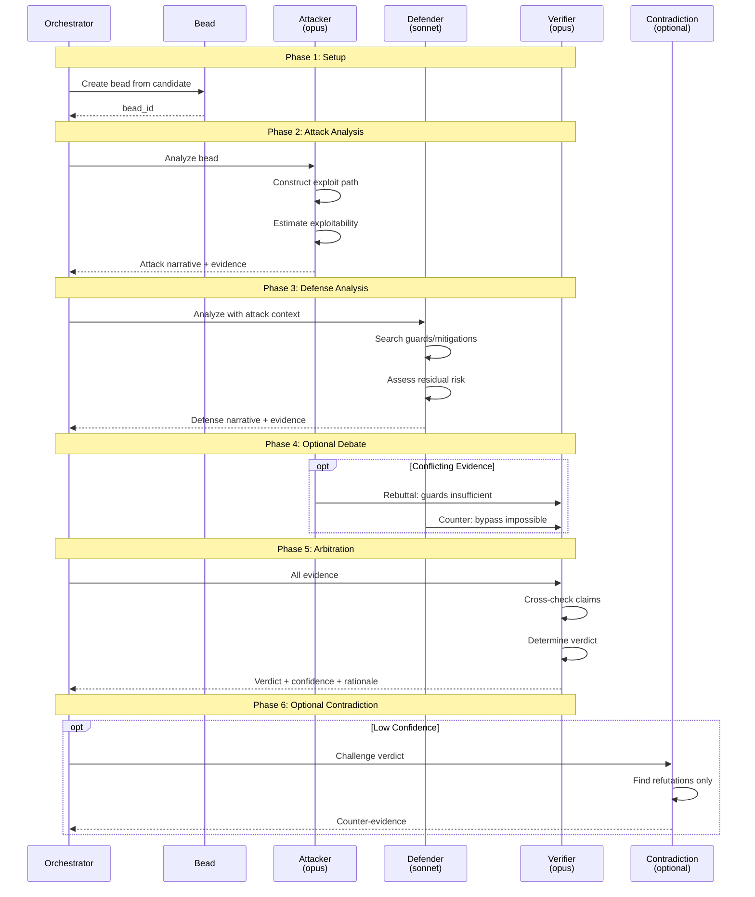
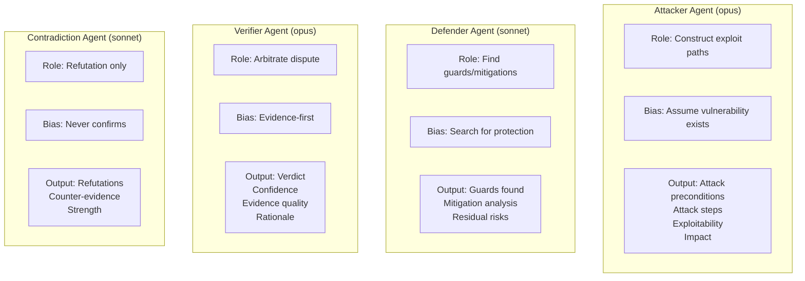
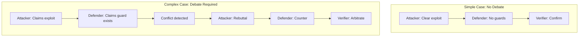
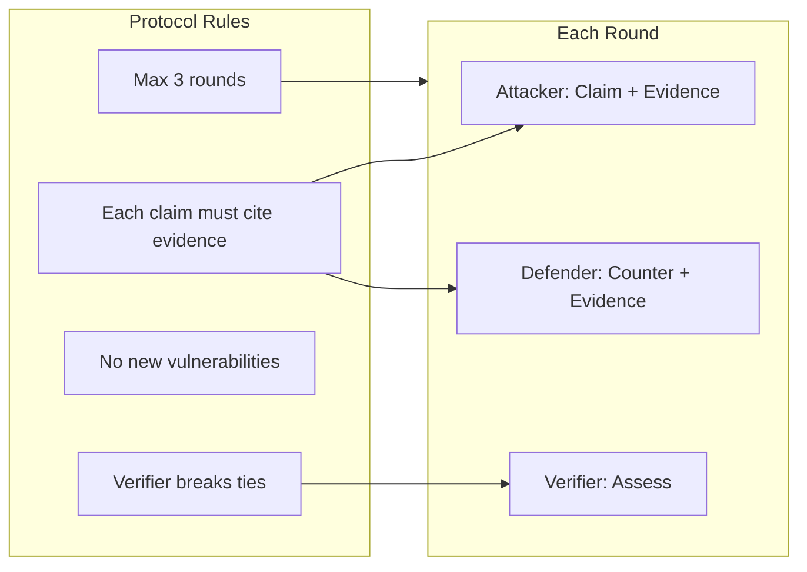
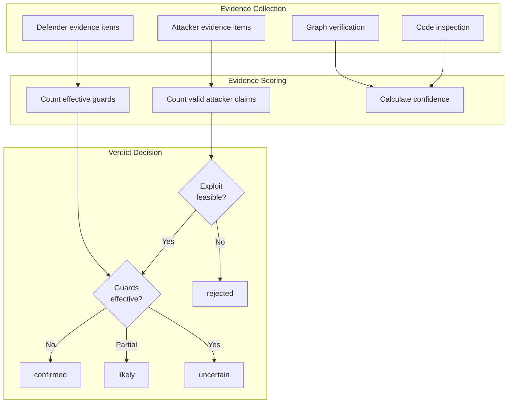
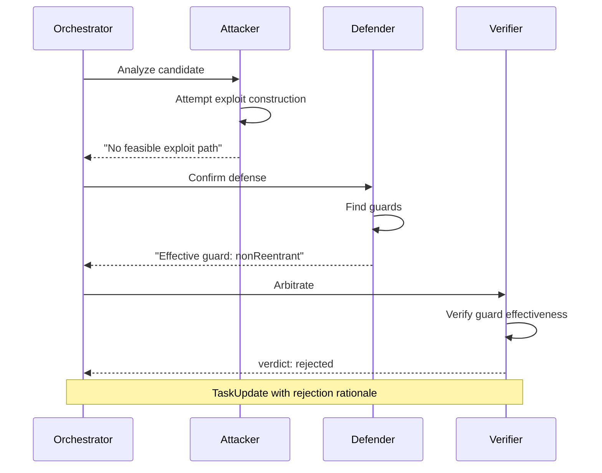
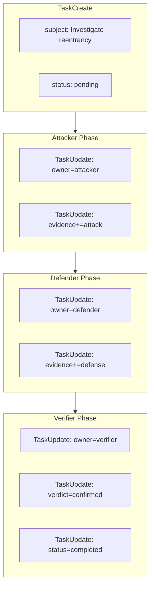
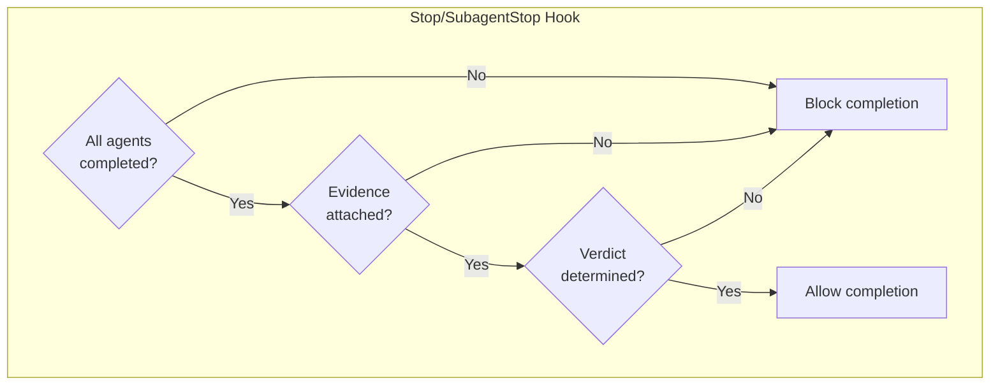

# Verification & Debate Protocol

**Purpose:** Define the multi-agent debate protocol for finding verification.

## Protocol Overview



## Agent Roles



## Evidence Requirements

### Attacker Evidence

```yaml
attacker_output:
  attack_preconditions:
    - "msg.sender can be any address"
    - "No rate limiting on withdraw"
  attack_steps:
    - step: 1
      action: "Call withdraw(100 ether)"
      result: "External call before state update"
    - step: 2
      action: "Reenter via fallback"
      result: "Drain funds"
  exploitability: "HIGH"
  impact: "Complete fund drainage"
  evidence:
    - type: "graph_node"
      id: "func_vault_withdraw_123"
      property: "behavioral_signature"
      value: "R:bal -> X:out -> W:bal"
    - type: "code_location"
      file: "Vault.sol"
      line: 48
      snippet: "msg.sender.call{value: amount}(\"\")"
```

### Defender Evidence

```yaml
defender_output:
  guards_found:
    - guard: "nonReentrant modifier"
      location: "Vault.sol:42"
      effectiveness: "NONE - not applied"
    - guard: "onlyOwner modifier"
      location: "Vault.sol:42"
      effectiveness: "PARTIAL - limits callers"
  mitigation_analysis: |
    The onlyOwner modifier limits attack surface but
    owner can still self-drain. No CEI pattern.
  residual_risks:
    - "Owner-initiated reentrancy still possible"
  evidence:
    - type: "graph_node"
      id: "func_vault_withdraw_123"
      property: "has_reentrancy_guard"
      value: false
```

### Verifier Evidence

```yaml
verifier_output:
  verdict: "confirmed"
  confidence: 0.92
  evidence_quality: "HIGH"
  verdict_rationale: |
    Attacker correctly identified R:bal -> X:out -> W:bal pattern.
    Defender found no effective guard (nonReentrant missing).
    onlyOwner limits attack surface but owner can exploit.
    Cross-checked with graph properties: has_reentrancy_guard=false.
  evidence_synthesis:
    attacker_claims_valid: 2
    attacker_claims_refuted: 0
    defender_guards_effective: 0
    defender_guards_partial: 1
```

## Debate Flow



### When Debate Triggers

| Condition | Debate? |
|-----------|---------|
| Attacker HIGH + Defender NO_GUARD | No |
| Attacker HIGH + Defender GUARD_FOUND | **Yes** |
| Attacker MEDIUM + Defender PARTIAL | **Yes** |
| Attacker LOW | No (discard) |

## Debate Protocol Rules



**Round Limits:**
- Round 1: Initial claims
- Round 2: Rebuttals
- Round 3: Final counter (if needed)
- After Round 3: Verifier decides

## Verdict Determination



**Confidence Calculation:**
```
confidence = (valid_attack_claims / total_claims) *
             (1 - effective_guards / total_guards) *
             graph_evidence_quality
```

## False Positive Flow



**Rejection Evidence Required:**
- Why exploit path fails
- Which guard prevents attack
- Graph evidence of guard presence

## Integration with Task System



## Hook Enforcement



## Marker Summary

| Phase | Markers |
|-------|---------|
| Attacker spawn | `[ATTACKER_SPAWN task_id]` |
| Attacker done | `[ATTACKER_DONE exploit:feasible/not_feasible]` |
| Defender spawn | `[DEFENDER_SPAWN task_id]` |
| Defender done | `[DEFENDER_DONE guards:N]` |
| Debate start | `[DEBATE_START task_id round:1]` |
| Debate round | `[DEBATE_ROUND:N]` |
| Verifier spawn | `[VERIFIER_SPAWN task_id]` |
| Verdict | `[VERDICT:confirmed/likely/uncertain/rejected confidence:0.XX]` |
| Contradiction | `[CONTRADICTION_SPAWN]` (optional) |
