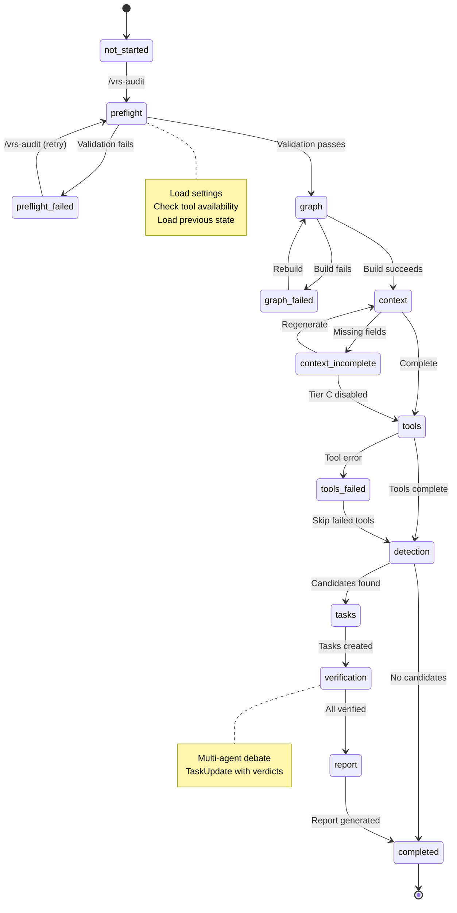
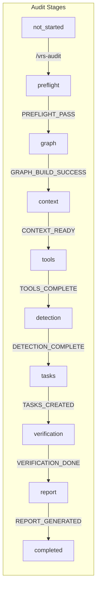
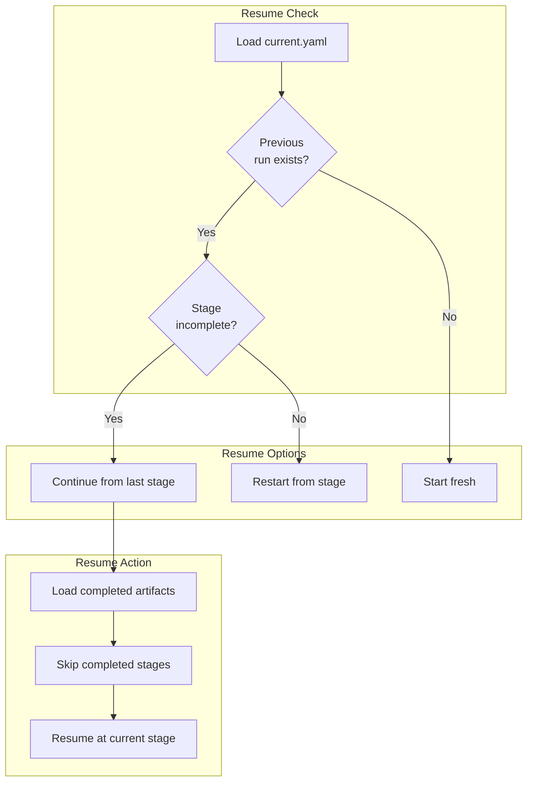
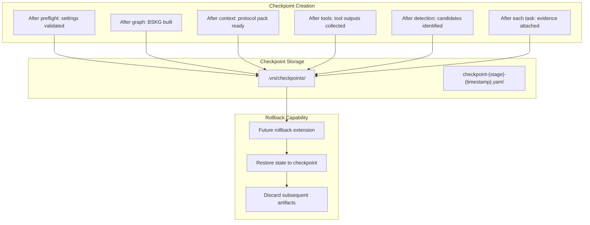
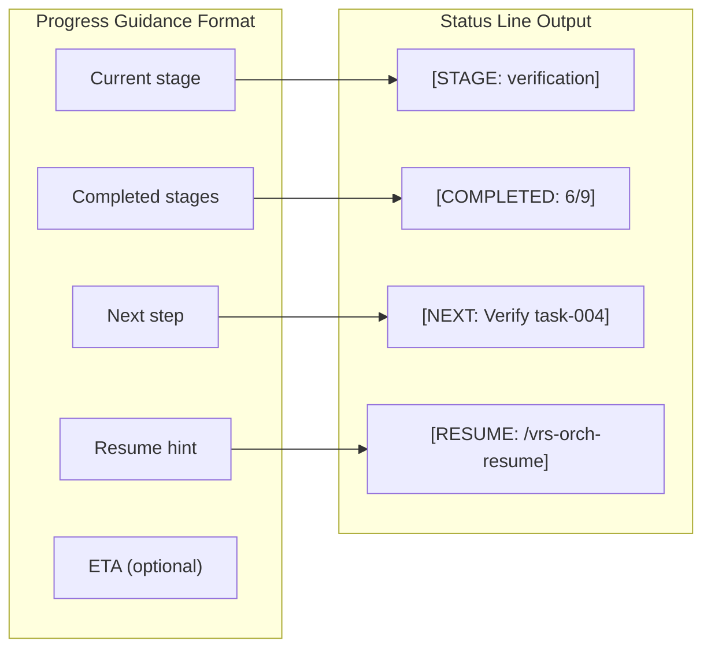
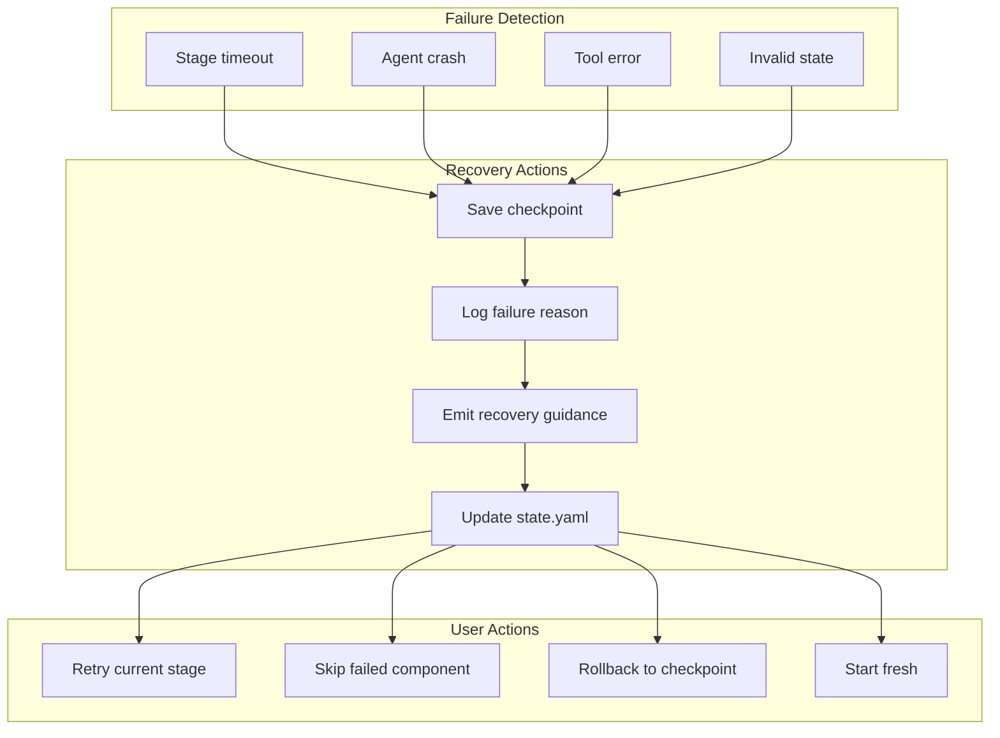
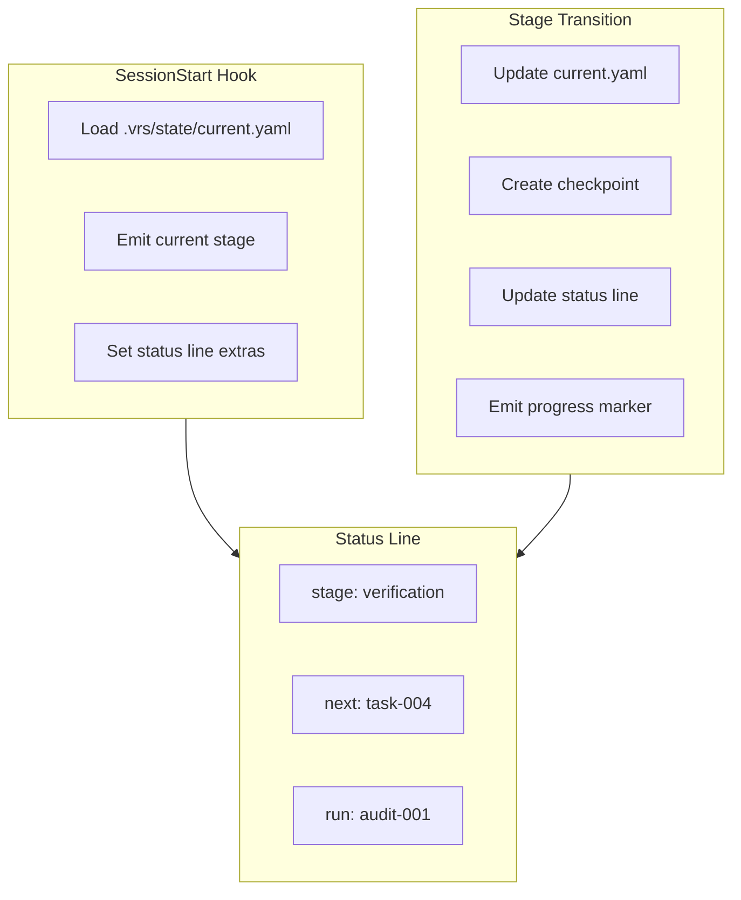

# Progress & State Management

**Purpose:** Define state transitions, checkpoints, and resume behavior.

## State Machine



## Stage Transitions



## State Schema

```yaml
# .vrs/state/current.yaml
version: "1.0"
run_id: "audit-2026-02-03-001"
started_at: "2026-02-03T14:30:00Z"
updated_at: "2026-02-03T14:45:00Z"

stage: "verification"
stage_started_at: "2026-02-03T14:42:00Z"

completed_stages:
  - stage: preflight
    completed_at: "2026-02-03T14:30:15Z"
    duration_ms: 15000
  - stage: graph
    completed_at: "2026-02-03T14:32:00Z"
    duration_ms: 105000
  - stage: context
    completed_at: "2026-02-03T14:35:00Z"
    duration_ms: 180000
  - stage: tools
    completed_at: "2026-02-03T14:38:00Z"
    duration_ms: 180000
  - stage: detection
    completed_at: "2026-02-03T14:40:00Z"
    duration_ms: 120000
  - stage: tasks
    completed_at: "2026-02-03T14:42:00Z"
    duration_ms: 120000

tasks:
  total: 5
  pending: 0
  in_progress: 2
  completed: 3
  items:
    - id: task-001
      status: completed
      verdict: confirmed
    - id: task-002
      status: completed
      verdict: rejected
    - id: task-003
      status: completed
      verdict: likely
    - id: task-004
      status: in_progress
      owner: vrs-defender
    - id: task-005
      status: in_progress
      owner: vrs-attacker

artifacts:
  graph: ".vrs/graphs/project.toon"
  context: ".vrs/context/protocol-pack.yaml"
  tools:
    slither: ".vrs/tools/slither.json"
    aderyn: ".vrs/tools/aderyn.json"

next_step: "Complete verification for task-004 and task-005"
resume_hint: "/vrs-orch-resume <pool-id>"

settings_hash: "sha256:abc123..."
commit_hash: "772c2fc"
```

## Resume Flow



### Resume Commands (Current + Planned)

**Note:** Resume is supported via orchestration workflows. Rollback remains a future extension.

```bash
# Check current state
cat .vrs/state/current.yaml

# Resume from where left off
/vrs-orch-resume <pool-id>

# Resume specific run
/vrs-orch-resume <pool-id>

# Restart from specific stage
/vrs-audit contracts/ --resume <run-id>

# Start fresh (discard state)
/vrs-audit contracts/ --fresh
```

## Checkpoint System



### Checkpoint Schema

```yaml
# .vrs/checkpoints/checkpoint-graph-2026-02-03T14:32:00Z.yaml
checkpoint_id: "cp-graph-001"
created_at: "2026-02-03T14:32:00Z"
stage: "graph"
run_id: "audit-2026-02-03-001"

state_snapshot:
  stage: "graph"
  completed_stages: [preflight]

artifacts_snapshot:
  - path: ".vrs/graphs/project.toon"
    hash: "sha256:def456..."
    size_bytes: 524288

rollback_command: "future-extension"
```

## Progress Guidance



### Progress Output Example

```
═══════════════════════════════════════════════════════════════════
  AlphaSwarm.sol Audit Progress
═══════════════════════════════════════════════════════════════════
  Run ID:     audit-2026-02-03-001
  Stage:      verification (7/9)
  Duration:   15 minutes

  ✓ preflight      (15s)
  ✓ graph          (1m 45s)
  ✓ context        (3m)
  ✓ tools          (3m)
  ✓ detection      (2m)
  ✓ tasks          (2m)
  → verification   (in progress)
    report
    completed

  Tasks: 3/5 completed
    - task-004: in_progress (defender)
    - task-005: in_progress (attacker)

  Next Step: Complete verification for task-004 and task-005
  Resume:    /vrs-orch-resume <pool-id>
═══════════════════════════════════════════════════════════════════
```

## Failure Recovery



### Failure State Schema

```yaml
# Added to current.yaml on failure
failure:
  occurred_at: "2026-02-03T14:50:00Z"
  stage: "tools"
  reason: "Slither timeout after 300s"
  recoverable: true
  recovery_options:
    - command: "/vrs-orch-resume <pool-id>"
      description: "Resume orchestration from current state"
    - command: "/vrs-audit contracts/ --resume <run-id>"
      description: "Re-enter audit flow with saved state"
    - command: "future rollback extension"
      description: "Rollback support planned"
```

## Session Integration



## Marker Summary

| Event | Marker | State Update |
|-------|--------|--------------|
| Stage start | `[STAGE_START: name]` | `stage: name` |
| Stage complete | `[STAGE_COMPLETE: name]` | `completed_stages += name` |
| Checkpoint created | `[CHECKPOINT: id]` | Checkpoint file created |
| Resume | `[RESUME_FROM: stage]` | Load checkpoint |
| Rollback | `[ROLLBACK_TO: stage]` | Restore checkpoint |
| Failure | `[FAILURE: reason]` | `failure: {...}` |
| Recovery | `[RECOVERY: action]` | Clear failure |
