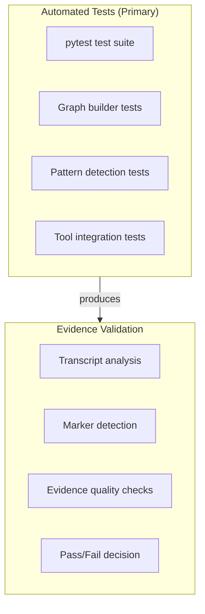
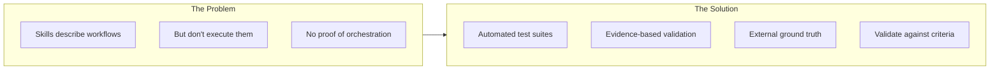
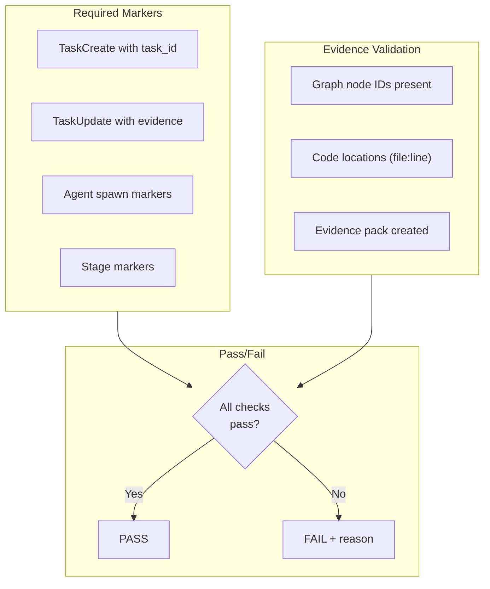
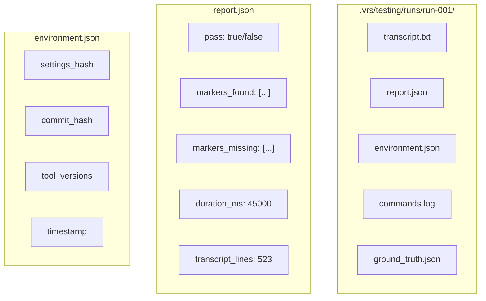
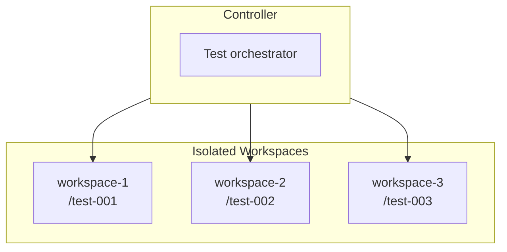
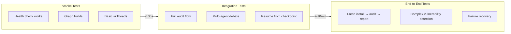

# Testing Architecture

**Purpose:** Define the testing patterns for workflow validation (development use only).

## Core Architecture



## Why This Architecture?



**Key Insight:** Testing skills by reading their source is insufficient. We must validate them through automated tests and evidence-based evaluation.

## Evaluation Criteria



### Marker Detection

```python
# Expected markers by workflow
REQUIRED_MARKERS = {
    "vrs-audit": [
        r"\[PREFLIGHT_PASS\]",
        r"\[GRAPH_BUILD_SUCCESS\]",
        r"TaskCreate",
        r"TaskUpdate",
        r"\[ATTACKER_SPAWN\]",
        r"\[VERDICT:",
    ],
    "vrs-health-check": [
        r"/vrs-health-check",
        r"health",
    ],
    "vrs-verify": [
        r"\[ATTACKER_SPAWN\]",
        r"\[DEFENDER_SPAWN\]",
        r"\[VERIFIER_SPAWN\]",
        r"\[VERDICT:",
    ],
}
```

## Evidence Pack Structure



### Evidence Pack Schema

```yaml
# report.json
{
  "run_id": "run-2026-02-03-001",
  "workflow": "vrs-audit",
  "pass": true,
  "started_at": "2026-02-03T14:30:00Z",
  "completed_at": "2026-02-03T14:45:00Z",
  "duration_ms": 900000,
  "markers": {
    "required": ["PREFLIGHT_PASS", "TaskCreate", "TaskUpdate", "VERDICT"],
    "found": ["PREFLIGHT_PASS", "TaskCreate", "TaskUpdate", "VERDICT:confirmed"],
    "missing": []
  },
  "evidence": {
    "task_ids": ["task-001", "task-002"],
    "verdicts": ["confirmed", "rejected"],
    "graph_nodes": 42,
    "code_locations": 15
  }
}
```

## Workflow-Specific Testing

### Install Workflow Test

Run `vrs-health-check` through Claude Code orchestration and capture transcript + tool events.

**Expected Markers:**
- `/vrs-health-check` invocation
- tool-call evidence (if health-check triggers CLI internally)
- Health check JSON output

### Audit Workflow Test

**Expected Markers:**
- `[PREFLIGHT_PASS]`
- `[GRAPH_BUILD_SUCCESS]`
- `TaskCreate`
- `[ATTACKER_SPAWN]`, `[DEFENDER_SPAWN]`, `[VERIFIER_SPAWN]`
- `TaskUpdate` with verdict
- `[VERDICT: confirmed/rejected]`

### Verification Workflow Test

**Expected Markers:**
- Agent spawns
- Debate markers (if triggered)
- `[VERDICT:]`

## Parallel Testing



**Parallel Testing Rules:**
- Each test in separate workspace
- No shared state between tests
- Evidence packs in separate directories

## Test Categories



| Category | Duration | Transcript Lines | Frequency |
|----------|----------|------------------|-----------|
| Smoke | < 30s | 50+ | Every change |
| Integration | 2-10min | 200+ | Daily |
| E2E | 10-30min | 500+ | Weekly |

## Marker Summary

| Test Phase | Markers |
|------------|---------|
| Setup | `[TEST_START]`, `[PANE_LAUNCHED]` |
| Execution | `[SKILL_INVOKED]`, workflow markers |
| Capture | `[TRANSCRIPT_CAPTURED]` |
| Evaluation | `[MARKERS_CHECKED]`, `[EVIDENCE_VALIDATED]` |
| Result | `[TEST_PASS]` or `[TEST_FAIL: reason]` |
