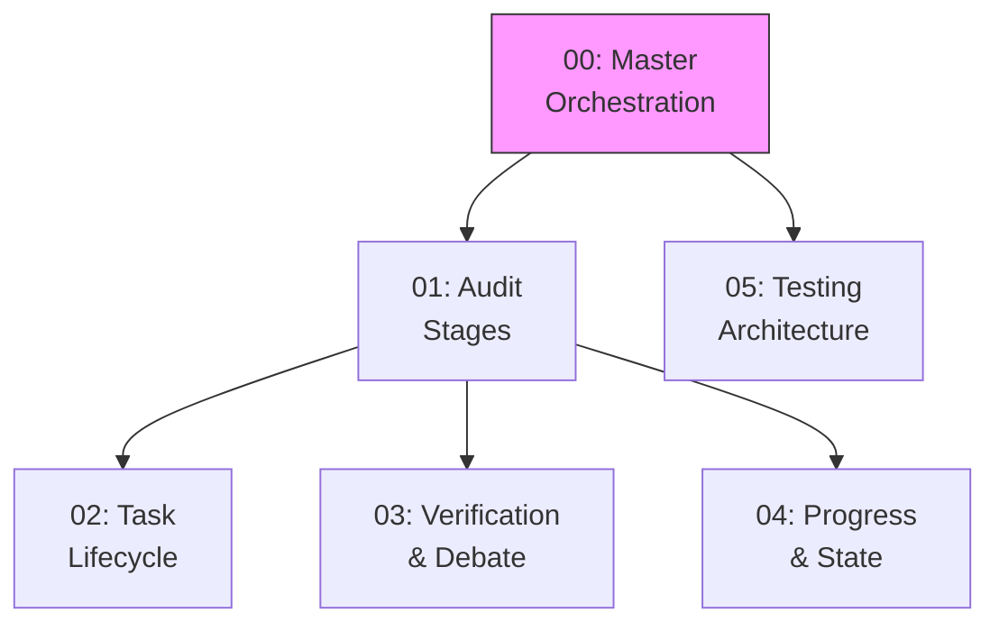

# Workflow Diagrams Index

**Purpose:** Central index of all workflow diagrams with progressive disclosure guidance.

## Diagram Catalog

| ID | Name | Purpose | Est. Tokens |
|----|------|---------|-------------|
| 00 | [Master Orchestration](00-master-orchestration.md) | How all workflows connect | ~2,500 |
| 01 | [Audit Stages](01-audit-stages.md) | 9-stage audit pipeline detail | ~3,500 |
| 02 | [Task Lifecycle](02-task-lifecycle.md) | TaskCreate/TaskUpdate state machine | ~2,500 |
| 03 | [Verification & Debate](03-verification-debate.md) | Multi-agent debate protocol | ~3,000 |
| 04 | [Progress & State](04-progress-state.md) | State transitions, resume, rollback | ~2,500 |
| 05 | [Testing Architecture](05-testing-architecture.md) | Dev testing patterns and evidence validation | ~2,000 |
| 06 | [Complete Architecture ASCII](06-complete-architecture-ascii.md) | All workflows in ASCII format | ~8,000 |

## When to Load Each Diagram

| Task | Load Diagram |
|------|--------------|
| Understanding system overview | 00-master-orchestration |
| Implementing audit workflow | 01-audit-stages |
| Working with tasks | 02-task-lifecycle |
| Implementing verification | 03-verification-debate |
| Implementing resume/rollback | 04-progress-state |
| Writing workflow tests | 05-testing-architecture |

## Diagram Dependencies



**Reading Order:**
1. Start with **00-master-orchestration** to understand the system
2. Deep dive into **01-audit-stages** for the main workflow
3. Load **02-task-lifecycle** when working with tasks
4. Load **03-verification-debate** when implementing agents
5. Load **04-progress-state** when implementing resume/checkpoints
6. Load **05-testing-architecture** when writing tests

## Quick Reference: Key Diagrams

### System Flow (from 00)
```
Install → Graph → Context → Tools → Audit → Tasks → Verify → Report
```

### Audit Stages (from 01)
```
Preflight → Graph → Context → Tools → Detection → Tasks → Verify → Report → Progress
```

### Task States (from 02)
```
pending → in_progress → completed
```

### Debate Protocol (from 03)
```
Attacker → Defender → [Debate] → Verifier → Verdict
```

### State Machine (from 04)
```
not_started → preflight → graph → context → tools → detection → tasks → verification → report → completed
```

### Testing Pattern (from 05)
```
Automated Tests → Evidence Validation → Pass/Fail
```

## Mermaid Rendering

All diagrams use Mermaid syntax. To render:

**In VS Code:** Install "Markdown Preview Mermaid Support" extension

**In GitHub:** Mermaid renders automatically in markdown preview

**Command Line:**
```bash
# Install mermaid-cli
npm install -g @mermaid-js/mermaid-cli

# Render to PNG
mmdc -i diagram.md -o diagram.png
```

## Cross-References

| Diagram | References | Workflow Document |
|---------|------------|-------------------|
| 00-master | `docs/workflows/README.md`, `docs/architecture.md` | System overview |
| 01-audit | `docs/workflows/workflow-audit.md` | Master audit workflow |
| 02-task | `docs/workflows/workflow-tasks.md` | Task orchestration |
| 03-verify | `docs/workflows/workflow-verify.md` | Verification & debate |
| 04-progress | `docs/workflows/workflow-progress.md` | Progress & state |
| 05-testing | `.planning/testing/workflows/workflow-orchestration.md` | Testing architecture |
| 06-ascii | All workflow-*.md files | Complete ASCII reference |

## Maintenance

**These diagrams are a live contract.** When ANY workflow changes:

1. **Update the workflow doc first** (`docs/workflows/workflow-*.md`)
2. **Update the corresponding diagram** - both Mermaid (00-05) AND ASCII (06)
3. **Update this index** if adding new diagrams
4. **Run validation** to check consistency:
   ```bash
   python3 scripts/validate_workflow_refs.py
   python3 scripts/validate_workflow_refs.py --strict
   ```

### Diagram-to-Workflow Mapping

| If you change... | Update these diagrams |
|------------------|----------------------|
| `workflow-install.md` | 00-master, 06-ascii (L1 Install) |
| `workflow-graph.md` | 00-master, 06-ascii (L1 Graph) |
| `workflow-context.md` | 00-master, 03-verify, 06-ascii (L2 Context) |
| `workflow-tools.md` | 00-master, 06-ascii (L2 Tools) |
| `workflow-audit.md` | 00-master, 01-audit, 06-ascii (L3 Audit) |
| `workflow-tasks.md` | 00-master, 01-audit, 02-task, 06-ascii (L3 Tasks) |
| `workflow-verify.md` | 00-master, 01-audit, 03-verify, 06-ascii (L4 Verify) |
| `workflow-progress.md` | 00-master, 04-progress, 06-ascii (L5 Progress) |
| `workflow-beads.md` | 00-master, 02-task, 06-ascii (L3 Beads) |
| Testing workflows | 05-testing, 06-ascii (L6 Testing) |
